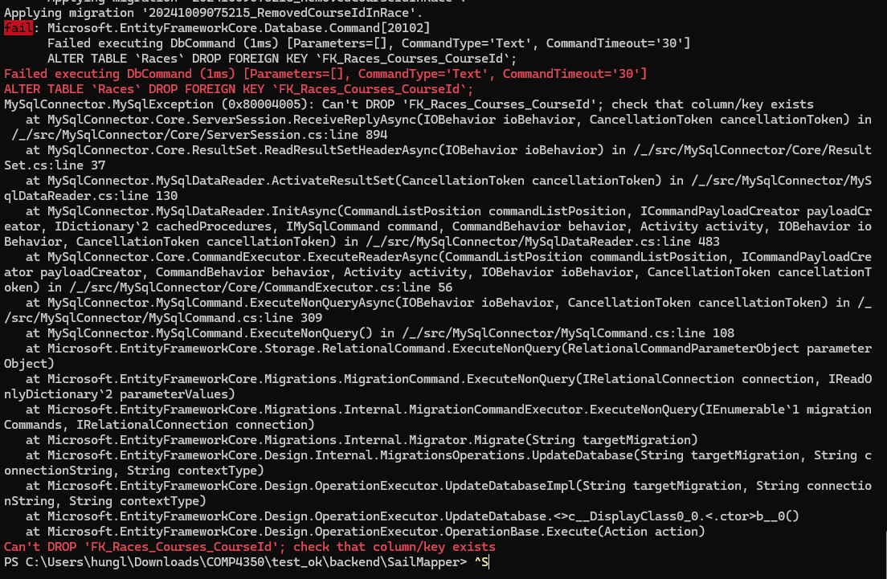
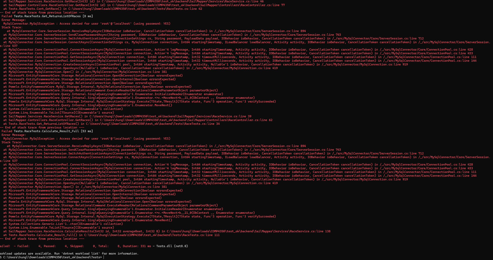
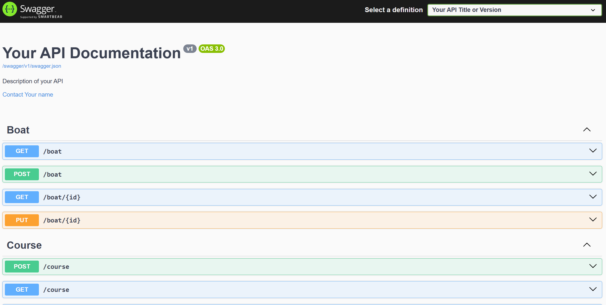
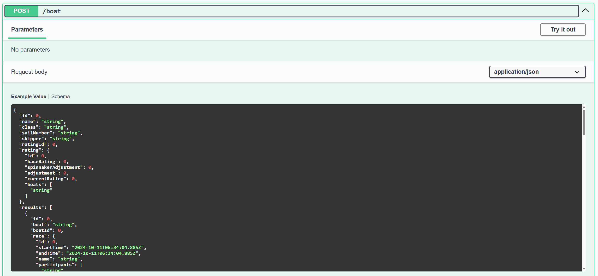
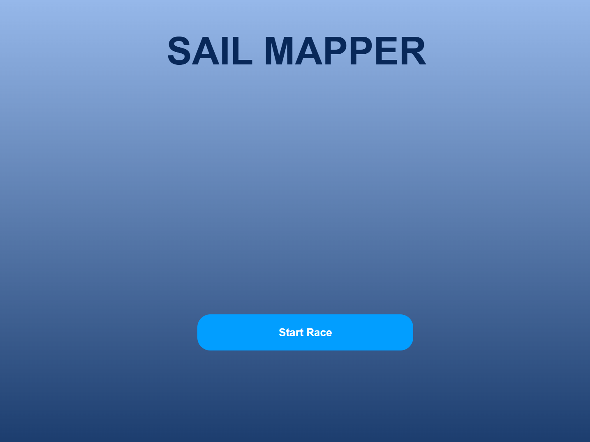
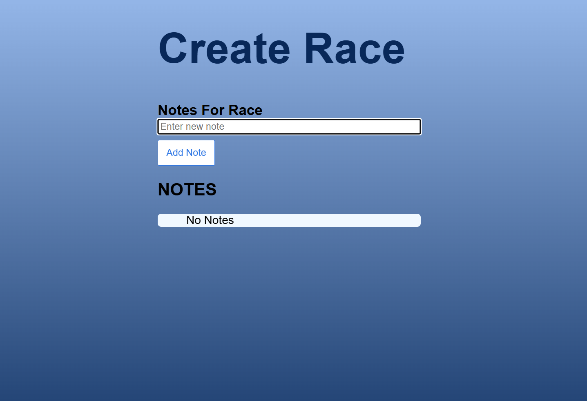
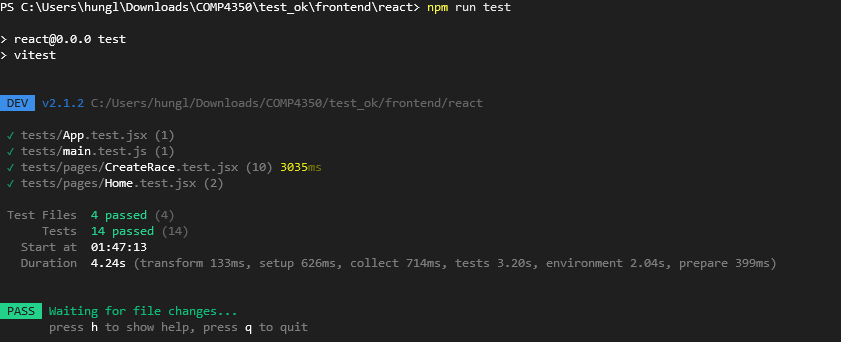
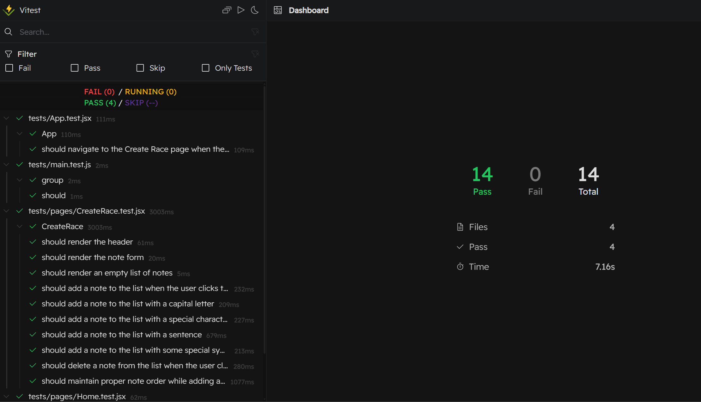

# Sprint 1 worksheet

## Testing
Please follow the link below to check out our **Testing Plan**
 * [Testing Plan](https://github.com/WilliamOdumah/RoomHub/blob/main/Documentation/TestingPlan.md)

## Unit/integration/acceptance tests
**1. Backend:**
  * For API routes, we have total 4 testing files include **indexRoute.test.js**, **userRoute.test.js**, **roomRoute.test.js** and **notificationRoute.test.js** which handle 100% method coverage. The only method that we could not test is the AWS Lambda handler function in line 27 of **index.js** file. This function used to process incoming events and route them to an Express.js Lambda server using using the **awsServerlessExpress** library. Since this function depends on AWS Lambda's execution context on AWS infrastructure, testing it in a local development environment is challenging because it requires AWS-specific event and context objects.

  * For logic classes, we have total 3 testing files which include **user.test.js**, **room.test.js** and **notification.test.js** which handle over 90% line coverage. However, we still have some functions were not being tested yet. From line 52, we have a function to check whether the notification message is valid or not. We did use that to check the message is valid when we create the new notification and when we test the create_notification method, it return a valid message so it doesn't necessary to test this function one more time and also we did set this function to private to make to secure to other class which make it harder to tests. From line 126, 138 and 147, we have three functions that help us to generate the notification message depends on the type (i.e: "join-request", "invite",...). Similar reason to the functon on line 52, when testing the **create_notification** function, we did check whether the message is being added properly into DynamoDB table when the notification successfully created. Therefore, it will be redundant to test these function one more time since these function just return a string which contain given parameter and these is not logic there to tests. 

  * For integration tests, we also have total 3 testing files include **UserPersistence.test.js**, **RoomPersistence.test.js**, and **Notification.test.js** which does handle fully 100% class coverage but we were still missing some % coverage of lines and method due to several reasons. First, from line 59 of UserPersistence and RoomPersistence and line 65 of NotificationPersistence, we set working_client to remote_client, but when do testing, we need to set the working client to local_client to work with fully local database. That is the reason why we don't use that anymore. In addition, from line 68-72 of UserPersistence (similar with line 69-73 of RoomPersistence and 73-77 of NotificationPersistence), we just define the getter function for **doc_client** and **table_name** of DynamoDB. These methods simply return a stored value without performing any additional logic. Testing them provides limited value because ther is no transformation or branching to validate. Instead, we did test these values indirectly by testing another public class's method that use these properties like **save_new_user**. Last but not least, from line 97 of UserPersistence (similar with line 122 of RoomPersistence and 138 of NotificationPersistence), we throw an error to handle if there is any undefined bugs happen in our methods. Since the **throw error;** is part of error-handling logic that interacts with DynamoDB. Hence, testing that would likely involve simulating or triggering real AWS errors, which is difficult for testing.

  
**2. Frontend:**
 * For Frontend, we did not have a logic layer since the UI just calling the API routes given from back end to decide whether go to next page (or state) based on API response. 
 * We did some acceptance tests manually for our UI based on the user stories we writed before. Here are a few key examples:
   **1. Landing Page Acceptance Test:** Verifies that when a user who is not logged in lands on the RoomHub page, they see the proper welcome message, login button, and branding elements. The test also checks that clicking the "Log In To Get Started" button redirects to the login page.
   **2. Login Acceptance Test:** Ensures that the login form contains the necessary fields (email, password), and users are correctly logged in upon entering valid credentials. It also verifies error handling, such as showing a clear error message when invalid credentials are used.
   **3. Home Page Acceptance Test:** Confirms that, after login, the user sees the appropriate options based on their status (e.g., "Create Room," "Join Room"). It ensures the presence of important UI elements like the notification bell and profile icon, and handles user interactions like clicking these elements.
 * We also prodive detailed steps which explain how to manually run our tests 
 and the expected outcome for the test below.

### Coverage report for class and line coverage

-----------------------------|---------|----------|---------|---------|-------------------
File                         | % Stmts | % Branch | % Funcs | % Lines | Uncovered Line #s 
-----------------------------|---------|----------|---------|---------|-------------------
All files                    |   94.87 |       91 |   84.21 |   94.87 |                   
 src/Handler                 |   97.33 |    95.71 |   89.47 |   97.33 |                   
  NotificationHandler.js     |      90 |    83.33 |   71.42 |      90 | 52,126,138-147    
  RoomHandler.js             |     100 |      100 |     100 |     100 |                   
  UserInfoHandler.js         |     100 |      100 |     100 |     100 |                   
 src/Persistence             |   88.88 |       75 |   73.91 |   88.88 |                   
  NotificationPersistence.js |   88.23 |       75 |   71.42 |   88.23 | 65,73-77,138      
  RoomPersistence.js         |    86.2 |    66.66 |   66.66 |    86.2 | 59,69-73,122      
  UserPersistence.js         |   91.11 |       80 |      80 |   91.11 | 59,68-72,97       
 src/Utility                 |     100 |      100 |     100 |     100 |                   
  Services.js                |     100 |      100 |     100 |     100 |                   
 src/router                  |   98.07 |      100 |    90.9 |   98.07 |                   
  Notification.js            |     100 |      100 |     100 |     100 |                   
  Room.js                    |     100 |      100 |     100 |     100 |                   
  User.js                    |     100 |      100 |     100 |     100 |                   
  index.js                   |   94.73 |      100 |      50 |   94.73 | 27                
 test/Integration-tests      |      96 |      100 |     100 |      96 |                   
  DbSetup.js                 |      96 |      100 |     100 |      96 | 102               
-----------------------------|---------|----------|---------|---------|-------------------

Test Suites: 10 passed, 10 total
Tests:       64 passed, 64 total
Snapshots:   0 total
Time:        6.287 s
Ran all test suites.

## Testing importance 

### Three most important unit tests
1. [RoomHub/Backend/test/Unit-tests/Handler/user.test.js](https://github.com/WilliamOdumah/RoomHub/blob/main/Backend/test/Unit-tests/Handler/user.test.js)
 * This file is testing the **UserInfoHandler** and related user routes in RoomHub application, specifically focusing on creating users, retrieving user room information, and fetching user notifications, it ensures correct responses, status code, and handling of edge cases including invalid input and backend errors.

2. [RoomHub/Backend/test/Unit-tests/Handler/room.test.js](https://github.com/WilliamOdumah/RoomHub/blob/main/Backend/test/Unit-tests/Handler/room.test.js)
 * This file is testing the functionality of creating rooms and adding roommates in the **RoomHandler** using unit tests with the Jest framework, mocking persistence services for users, rooms, and notifications.

3. [RoomHub/Backend/test/Unit-tests/Handler/notification.test.js](https://github.com/WilliamOdumah/RoomHub/blob/main/Backend/test/Unit-tests/Handler/notification.test.js)
 * This file is testing the functionality of creating notifications in the **NotificationHandler** using unit tests with Jest, mocking user and notification persistence services

### Three most important integration tests
1. [RoomHub/Backend/test/Integration-tests/UserPersistence.test.js](https://github.com/WilliamOdumah/RoomHub/blob/main/Backend/test/Integration-tests/UserPersistence.test.js)
 * This file is integration testing the **UserPersistence** class with DynamoDB table database, ensuring correct functionality for creating, retrieving, and updating user-related data in a database.

2. [RoomHub/Backend/test/Integration-tests/RoomPersistence.test.js](https://github.com/WilliamOdumah/RoomHub/blob/main/Backend/test/Integration-tests/RoomPersistence.test.js)
 * This file is integration testing the **RoomPersistence** class with DynamoDB table database, ensuring correct functionality for retrieving room names, creating new rooms, and adding roomates while handling possible errors in these operations.

3. [RoomHub/Backend/test/Integration-tests/NotificationPersistence.test.js](https://github.com/WilliamOdumah/RoomHub/blob/main/Backend/test/Integration-tests/NotificationPersistence.test.js)
 * This file is testing the **NotificationPersistence** class with DynamoDB table database, ensuring correct functionality for retrieving, creating, and updating notification, while handling potential errors in these processes.

### Three most important acceptance tests 
Our acceptance tests were done manually:
**1. Signup Acceptance Test:**
 * **Precondition**: User navigates to the login page.
   * Action: User interacts with the AWS Cognito Authentication signup form.
   * Steps:
      1. The form should include fields for **"Email"**, **"Password"**, and **"Confirm Password"**.
      2. A **"Sign Up"** button should be available.
 * **Expected Outcome**: 
   * If all fields are correctly filled, the user receives a prompt to verify their email with a confirmation code.
   * If any fields are invalid (e.g., weak password), an appropriate error message is shown.
 * **Behaviour Upon Verification:**
   * Upon entering the correct verification code, the user is redirected to the login page with a success message.
 * **User stories:** 
   * [As a user, I should be able to create an account](https://github.com/WilliamOdumah/RoomHub/issues/3)

**2. Create Room Acceptance Test:**
 * **Precondition:** User is on the **"Create Room"** page.
   * Action: User attepmts to create a room.
   * Steps:
      1. The user enters a name in the **"Room Name"** input field.
      2. Clicks the **"Create Room"** button.
 * **Expected Outcome:** 
   * A confirmation message appears, and the user is redirected to the **"Virtual Room"** page
 * **Behaviour Upon Error:**
   * If the input field is empty, an error message prompts the user to enter a room name.
 * **User stories:** 
   * [As a user, I should be able to create a new room](https://github.com/WilliamOdumah/RoomHub/issues/9)
   * [As a user, I should be able to name my room](https://github.com/WilliamOdumah/RoomHub/issues/10)

**3. Notifications Acceptance Test:**
 * **Precondition:** User is on the **"Notifications"** page and has notifications.
   * Action: User reviews their notifications.
   * Steps:
      1. The user sees a list of notifications (e.g., "User1 requests to join your room").
      2. Clicks the **"Accept"** button for pending requests.
 * **Expected Outcome:**
   * Accepted notifications update to **"accepted"** status.
   * Room membership is updated accordingly.
 * **Behaviour Upon Error:**
   * If the backend fails, an error message informs the user.
 * **User stories:**
   * [As a user, I should be able to accept requests from my notifications](https://github.com/WilliamOdumah/RoomHub/issues/107)
   * [As a user, I should receive a notification when another user requests to join my room](https://github.com/WilliamOdumah/RoomHub/issues/105)

## Reproducible environments
For this part, we did try to run team 8 application 2 times.
* For the first time, we did not encounter any issues with installing Visual Studio, as it was already set up on our system. However, the instructions did not specify a particular version of MySQL, so we proceeded with installing the latest available version. While the MySQL installation took around twenty minutes, it was significantly longer than we expected. Also, we need to understanding how to use Visual Studio which required some additional time, as we had to familiarize ourself with its features. The files we were required to install, particularly the .NET packages, were quite large. Unfortunately, due to the lack of specificity in the instructions, we initially downloaded the wrong package, which extended the installation process significantly. Once the correct .NET package was installed, everything worked smoothly until we encountered an issue running the **`dotnet ef database update`** command, which resulted in an below error.

We believe the issue originates from the version of the MySQL package, so we downloaded and installed the package again using a different version of MySQL. However, after rerunning the command **`dotnet ef database update`** we continued to encounter the same error.

* For the second time, we noticed the instructions were not clear enough since it just require us to download MySQL without provide guidance on how to set up the configuration. We also recognized that we need to changed DB username and password from SailDBContext.cs and appsettings.json file in their project based on the credential of MySQL account we created when doing configuration. This is the reason why we got the error from the first trial. From this time, we did be able to run the command **`dotnet ef database update`** but still got error after some database table being updated

After that, we were trying to run the **`dotnet test`** command to check for the tests. We didn't see they have any folder to divide the unit tests and integration tests but only saw two files in Tests folder so we assume the command we use will run these files. After finish running, we got this error:

Overral, we noticed that they have 8 tests with 4 passes and 4 fails 

We also run their backend API as following instructions and this is the result:

After that, we did run their react front end with the command **`npm run dev`** and this is the result:

At the end, we did run their acceptance tests by using command **`npm run test`** or **`npm run test:ui`** and this is the result:

In conclusion, we conclude that the documentation of installing stuffs was not clear enough for the new developer who starting working on this project. However, other instruction commands after were quite unambiguous of how to run and test properly. 