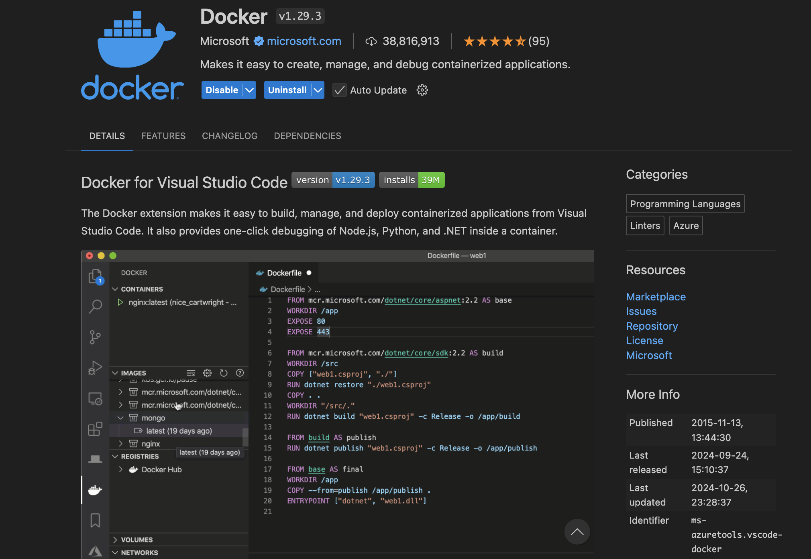

# RoomHub
### Team Members
• Daniel Aderemi Fawoye
• Hung Lu Dao
• Camila Martinez Ovando
• William Odumah

### Vision Statement
To transform shared living by simplifying household organization and helping people find the perfect roommates.

### Key Objectives:

* **Efficient Organization:** Streamlines expense tracking and chore management, reducing the complexity of shared living arrangements.
* **Informed Decisions:** The app enables users to find roommates who match their living style based on honest feedback from previous roommates.
* **Convenience:** Automated reminders and notifications keep users on top of payments and tasks, fostering a more organized and stress-free living environment.


### Core Features

* **Shared Expenses Calculator:**
Users can add and track expenses such as rent, groceries, and insurance, with a clear view of how much each person owes.

* **Tasks Organizer:**
Roommates can assign and manage household chores, ensuring that responsibilities are clearly defined and everyone knows their tasks.

* **Reminders and Notifications:**
The app sends alerts for upcoming payments and pending tasks, helping users stay organized and on track.

* **Rate Your Roommate:**
Users can rate and provide detailed feedback about their roommates, offering valuable insights that help future users make informed decisions.

### Technology Stack

* #### Front End:
  * **React.js:**
  A robust library for building interactive and dynamic web interfaces, ensuring a responsive and engaging user experience. React.js will be utilized for the web version of the Roomies app.

  * **Flutter:**
  A cross-platform framework for creating high-performance applications for mobile, web, and desktop from a single codebase, ensuring a consistent look and feel across different devices. Flutter will be used for the mobile and desktop applications.

* #### Back End:

  * **Express:**
  A minimal and flexible Node.js web application framework that is ideal for handling HTTP requests and server-side logic efficiently, making it a suitable choice for API development.

  * **Database:**
    **DynamoDb:**
    A managed nosql database service service that has direct javascript compatibility, offering automated backups, scaling, and high availability. This will serve as the primary database for the app, ensuring robust data management and reliability.

### How to Run the Project
To get started with the RoomHub application, follow the instructions in the respective README files for the [Front End](link-to-frontend-readme) and [Back End](link-to-backend-readme). These files provide detailed steps on setting up the development environment, running the project locally, and executing tests.

### Web Front End:
- Instructions for running and testing the React front-end are available in the [Front End README](https://github.com/WilliamOdumah/RoomHub/blob/main/Frontend/README.md).

### Flutter Front End:
- Instructions for running and testing the Flutter front-end are available in the [Flutter Front End README](https://github.com/WilliamOdumah/RoomHub/blob/main/README.md).

### Back End:
- Steps for setting up the Express backend and performing tests are documented in the [Back End README](https://github.com/WilliamOdumah/RoomHub/tree/main/Backend/README.md).

### Meeting Minutes:
- [Meeting Minutes](https://docs.google.com/document/d/1gmPyqcMPgaCIxmgW3wgfEdduZb-75aF9UhfTTLr__OI/edit?usp=sharing)

### Sequence Diagrams:
- [Sequence Diagrams](https://docs.google.com/document/d/1M3B92XEyDP4L9LY-5olZOBhAJlwPlI1XnUZCIL129f8/edit?usp=sharing)

### How to run the Docker:
If docker doesn't work:
1. Make sure `docker`, `docker-compose` and `Docker Desktop Application` are installed. To check:
    ```
    $ docker -v
    $ docker-compose --version
    ```
    - Go to [https://docs.docker.com/desktop/](https://docs.docker.com/desktop/) to download the Docker Desktop Application based on your Operating System ('Mac', 'Windows' or 'Linux').
    - Open `EXTENSIONS` in Visual Studio Code and search for `Docker` and install this extension:
    
    You should download the correct extension as shown above.
    - Open `Terminal` in Visual Studio Code and enter this command: `sudo curl -L "https://github.com/docker/compose/releases/download/v2.21.0/docker-compose-$(uname -s)-$(uname -m)" -o /usr/local/bin/docker-compose`. You may need to replace `v2.21.0` with your current docker version by running command `docker -v` above. Then run this command: `sudo chmod +x /usr/local/bin/docker-compose` (make sure you are in RoomHub directory).
    
2. Build docker: make sure you are opening Docker Desktop Application in your machine.
    ```
    $ docker-compose up --build
    ```
